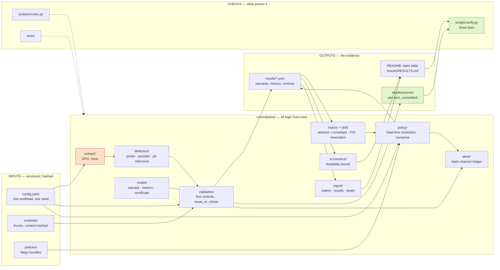

<div align="center">

<!-- Gradient banner line -->


<br/>

**A detector produces a score. A warrant is a separate, time-bounded, evidence-backed statement about what that score is worth on this distribution right now.**

<br/>

<!-- Tech Stack Badges -->
[](https://python.org)
[](https://pytorch.org)
[](https://scikit-learn.org)
[](https://huggingface.co/Qwen)
[](https://microsoft.github.io/presidio/)
[](https://www.openpolicyagent.org/)
[](LICENSE)

<br/>

**Warrant Issuance · Detector Validation · Policy Composition · Drift Monitoring · Feasibility Bounds**

<br/>

[Quick Start](#-quickstart) •
[Claim Table](#-the-claim-table) •
[Architecture](#how-it-fits-together) •
[Reproduction](#-reproduction) •
[Documents](#-documents) •
[Limitations](#%EF%B8%8F-limitations-and-open-items)

<br/>


&nbsp;

&nbsp;

&nbsp;


</div>


<br/>

Everyone ships detectors. Almost nobody ships the second thing — so a guardrail
that has quietly stopped working looks exactly like one that works, and the
dashboard stays green either way. ControlPlane measures each detector on a named
evaluation envelope, issues a warrant with bounds and an expiry when the evidence
supports it, and **refuses one when it does not**; policy then reads the warrant
rather than the score. It is the same idea as a TLS certificate: issued by
something other than the server, bounded in time, revocable when the facts
change — and nobody has ever thought the certificate makes the server good.

> [!NOTE]
> **Built for the Accenture Innovation Challenge 2026** · Problem Statement 1 · *ControlPlane.ai*
>
> Team **Dominator** — Indian Institute of Technology Kharagpur

<br/>

<div align="center">
<table>
<tr>
<td align="center" width="25%">
<br/>
<br/><br/>
<sub><b>Evidence-backed, time-bounded</b><br/>quality assurance via warrants</sub>
<br/><br/>
</td>
<td align="center" width="25%">
<br/>
<br/><br/>
<sub><b>Every claim traces to an artifact</b><br/><code>make verify</code> proves it</sub>
<br/><br/>
</td>
<td align="center" width="25%">
<br/>
<br/><br/>
<sub><b>One dot-product probe</b><br/>free next to generation cost</sub>
<br/><br/>
</td>
<td align="center" width="25%">
<br/>
<br/><br/>
<sub><b>Refuses warrants</b><br/>when evidence is absent</sub>
<br/><br/>
</td>
</tr>
</table>
</div>


<br/>

## ⚡ Quickstart

> Under five minutes on a laptop. No GPU, no network after the clone.

```bash
git clone https://github.com/kksahu444/controlplane.git
cd controlplane
git fetch origin "refs/notes/*:refs/notes/*"     # see "Reading the history" below
python -m venv .venv && . .venv/bin/activate     # Windows: .venv\Scripts\activate
pip install -r requirements.lock.txt
make verify
```

`make verify` prints every number in the claim table below beside the value
measured on your machine, then recomputes every metrics block from the frozen
per-item scores in `results/scores/`. It exits non-zero if any of them drift.
Both of those run on a fresh clone; a third, deeper check re-derives the scores
from cached activations and reports SKIPPED without them.

---

## 🚫 What this is not

> Stating the scope is worth more than having it inferred.

| | |
|:---|:---|
| 🔒 **Not deployed** | No auth, no rate limiting, no HA, no deployment manifests. There is no serving layer and adding one is explicitly out of scope. |
| ⚖️ **Not a verdict** | A detector is a trigger for spending an expensive check. Nothing here blocks, filters or gates a user-facing response. |
| 🔬 **Not a general result** | Measured on 2,400 TriviaQA items and hand-built PII sets, one model family (Qwen2.5-7B-Instruct, NF4), no real production traffic. |
| 🚧 **Not fully built** | Phase 9's action gate and Phase 6's price list were specified and never written; five contract documents still cite a `controlplane/economics/sizing.py` that does not exist. So **every cost, headcount or ROI figure anywhere in this repository is a declared estimate**, and says so. The feasibility bound below is the exception — it is derived from measured rates and needs no cost model. `DECISIONS.md` 096 and 099, declared in [docs/LIMITATIONS.md](docs/LIMITATIONS.md). |
| 🧠 **Not a claim about truthfulness** | The probe is a correlational classifier over activations. It does not measure what a model believes. |

---

## 📊 The claim table

Every quantitative claim this repository makes, the artifact that contains it,
and the field inside that artifact. `make verify` parses this table, resolves
each field, and compares at the precision quoted. **A number edited by hand
here fails the build.**

> All intervals are 95% bootstrap-percentile over questions, seed 1729.

| Claim | Value | Interval | Artifact | Field | Regenerate |
|---|---|---|---|---|---|
| Probe AUROC, `triviaqa-600`, n=600 | 0.8256 | [0.7934, 0.8567] | results/validation-T1-last_token.json | metrics.auroc.value | make verify |
| Probe recall at its operating point | 0.0794 | [0.0496, 0.1115] | results/validation-T1-last_token.json | metrics.recall.value | make verify |
| Probe precision there | 0.8800 | [0.7500, 1.0000] | results/validation-T1-last_token.json | metrics.precision.value | make verify |
| Measured flag rate there | 0.0417 | [0.0267, 0.0583] | results/validation-T1-last_token.json | metrics.flag_rate.value | make verify |
| Base error rate of that envelope | 0.4617 | - | results/validation-T1-last_token.json | base_rate | make verify |
| Last-token probe survives the long-context shift | 0.8135 | [0.7797, 0.8447] | results/transfer-T1-last_token.json | target.metrics.auroc.value | make verify |
| Mean-pool probe collapses to chance under it | 0.5015 | [0.4546, 0.5479] | results/transfer-T1-mean_pool.json | target.metrics.auroc.value | make verify |
| Max-rolling-means probe under it | 0.5553 | [0.5105, 0.6015] | results/transfer-T1-max_rolling_means.json | target.metrics.auroc.value | make verify |
| ...and it flags 54% of the stream | 0.5433 | [0.5050, 0.5833] | results/transfer-T1-max_rolling_means.json | target.metrics.flag_rate.value | make verify |
| `customer_support` recall, n=960 | 0.2171 | [0.1800, 0.2564] | results/policy-triviaqa-2400-t960.json | operating_points[operating_point.operating_point_id=P-customer-support].metrics.recall.value | make verify |
| `customer_support` measured flag rate | 0.1062 | [0.0885, 0.1260] | results/policy-triviaqa-2400-t960.json | operating_points[operating_point.operating_point_id=P-customer-support].metrics.flag_rate.value | make verify |
| `internal_knowledge` recall, n=960 | 0.3603 | [0.3173, 0.4063] | results/policy-triviaqa-2400-t960.json | operating_points[operating_point.operating_point_id=P-internal-knowledge].metrics.recall.value | make verify |
| `decision_support` recall, n=960 | 0.7367 | [0.6974, 0.7783] | results/policy-triviaqa-2400-t960.json | operating_points[operating_point.operating_point_id=P-decision-support].metrics.recall.value | make verify |
| Cost of the training reduction, paired on 600 held-out items | -0.0110 | [-0.0200, -0.0026] | results/paired_comparison.json | pinned_to_baseline_threshold[quantity=auroc].difference | make verify |
| Selection-aware widening of the recall bound | 1.5922 | - | results/paired_comparison.json | selection_aware_bounds[operating_point_id=P-customer-support].widening | make verify |
| Round 1 reproduced on Round 2's pipeline | 0.8256 | - | results/reconciliation.json | round2.T1-last_token.test_auroc | make verify |
| ...landing inside Round 1's published interval | A | - | results/reconciliation.json | branch | make verify |
| `presidio-stock` recall on Hinglish PII, REFUSED | 0.1176 | [0.0500, 0.2000] | results/detectors.json | runs[detector_id=presidio-stock,eval_set_id=hinglish-pii-200].metrics.recall.value | make verify |
| `presidio-enabled` recall, REFUSED | 0.2843 | [0.2075, 0.3810] | results/detectors.json | runs[detector_id=presidio-enabled,eval_set_id=hinglish-pii-200].metrics.recall.value | make verify |
| `presidio-enabled_plus_custom` recall, VALID | 0.6176 | [0.5185, 0.7128] | results/detectors.json | runs[detector_id=presidio-enabled_plus_custom,eval_set_id=hinglish-pii-200].metrics.recall.value | make verify |
| Our `pii-reference` recall, VALID | 0.7941 | [0.6981, 0.8846] | results/detectors.json | runs[detector_id=pii-reference,eval_set_id=hinglish-pii-200].metrics.recall.value | make verify |
| `presidio-stock` reproduces out of sample | 0.1471 | [0.0714, 0.2341] | results/holdout/detectors.json | runs[detector_id=presidio-stock,eval_set_id=hinglish-pii-200b].metrics.recall.value | make verify |
| `pii-reference` false-positive rate on benign traffic | 0.0000 | [0.0000, 0.0183] | results/validation-pii-reference-hard-negatives-200.json | metrics.flag_rate.value | make verify |
| Warrant matrix cells VALID | 13 | - | results/warrant_matrix.json | matrix.summary.VALID | make verify |
| Warrant matrix cells REFUSED | 4 | - | results/warrant_matrix.json | matrix.summary.REFUSED | make verify |
| Warrant matrix cells never measured | 39 | - | results/warrant_matrix.json | matrix.summary.UNVALIDATED | make verify |
| Abstention floor at a 5% residual-risk target | 0.4221 | - | results/feasibility.json | abstention_floor[target_risk=0.05].floor | python scripts/11_feasibility.py |
| ...at a 10% target | 0.3900 | - | results/feasibility.json | abstention_floor[target_risk=0.1].floor | python scripts/11_feasibility.py |
| Residual risk `decision_support` actually ships | 0.2231 | - | results/feasibility.json | profiles[operating_point_id=P-decision-support].achieved_risk.residual_risk | python scripts/11_feasibility.py |
| ...costing this multiple of the perfect-selector floor | 1.5941 | - | results/feasibility.json | profiles[operating_point_id=P-decision-support].achieved_risk.efficiency | python scripts/11_feasibility.py |
| `customer_support` at the same measure | 1.1490 | - | results/feasibility.json | profiles[operating_point_id=P-customer-support].achieved_risk.efficiency | python scripts/11_feasibility.py |

<details>
<summary><strong>📖 How to read this table</strong></summary>

<br/>

**How to read the last three rows.** 39 of 56 cells are UNVALIDATED. That is
not a gap in the work — it is the expected shape of the thing. UNVALIDATED is
the modal state in any real deployment, and a system that cannot say *"this
detector has never been measured on this distribution"* will instead say
something confident and wrong.

**The last five rows are the feasibility bound**, and they are the one part of
this table that is not about our detector. Given a measured base error rate,
holding residual risk at 5% requires abstaining on at least 42.2% of traffic —
for *any* selector, however good. That is an impossibility result, and it is why
"just tighten the threshold" is not an available answer. The two efficiency rows
say how far each operating point sits above that floor at the risk it actually
ships: 1.15× at `customer_support`, 1.59× at `decision_support`. See
[docs/PROPOSAL.md](docs/PROPOSAL.md) §1–2.

**Read the probe recall with its base rate.** 0.0794 recall at a 4.2% flag rate
is a `lift` of roughly 1.9x over random sampling at the same budget, and the
ceiling at base rate 0.4617 is 2.17x. The headline is not "the probe is
accurate". It is that the number, its interval and its ceiling are all on the
record, and that the same machinery **refuses** three of the detectors it was
pointed at.

</details>

---

## 🗂️ Repo map

```
controlplane/          the package — model, store, validation, matrix, drift, policy, detectors, report
evalsets/ & results/   frozen content-hashed evaluation sets; every artifact behind the table above
scripts/ & demo/       thin CLI wrappers, the two-pane demo runner
notebooks/             the Kaggle GPU notebook (generated, never hand-edited)
tests/                 870 tests, including the ones that enforce this README
docs/                  spec, methods, limitations, the case matrix, and the move mapping
DECISIONS.md           118 append-only decision entries
round1/                the Round 1 submission, moved whole
```

### How it fits together

> Read left to right: the GPU stage runs once and caches, everything downstream
> reads from disk, and the last column is what a stranger can check without a GPU.



`scripts/` and `demo/` are thin wrappers around the middle column and hold no
logic of their own. The stage-by-stage version, the warrant lifecycle and seven
other diagrams are in [docs/DIAGRAMS.md](docs/DIAGRAMS.md); the package-by-package
tour is [docs/CODE_TOUR.md](docs/CODE_TOUR.md).

---

## 🔬 Reproduction

| Target | Without `make` | Requires | Time | Proves |
|:---|:---|:---|:---|:---|
| `make smoke` | `python scripts/smoke.py` | CPU, no network | < 60s | The clone works and the package imports |
| `make test` | `python -m pytest tests/ -q` | CPU | ~10 min | 870 tests green |
| `make verify` | `python scripts/verify.py` | CPU | ~3 min | **Every claim reproduces, and every metric recomputes from frozen scores** |
| `make verify` (tier 3) | `python scripts/verify.py` | CPU + cached activations | ~4 min | The frozen scores re-derive from the activations |
| `make extract` | `python scripts/00_extract.py --config config.yaml` | GPU, 16 GB | ~1 h | Activations regenerate from the source model |

Every recipe in the Makefile is a single command with no shell logic in it, so
the middle column is exact rather than approximate. If you are on Windows
without make, use it directly.

<details>
<summary><strong>🔍 <code>make verify</code> — the three tiers</strong></summary>

<br/>

`make verify` is the "prove it" button as a command line. Three checks,
weakest first, each proving something the one before it cannot:

1. **The claim table against the committed artifacts.** Resolves every field
   named above and compares at the quoted precision. Needs nothing but the
   repository. Cannot detect a README and a set of artifacts that went stale
   *together*.
2. **Every metrics block recomputed from frozen per-item scores.** Catches
   exactly that: an artifact whose numbers no longer follow from the data behind
   them. `results/scores/` holds the labels, scores and question ids for all 24
   measured (detector, envelope) blocks — about 200 KB, committed — and the
   recomputation uses the same builder, bootstrap count and seed. **This runs on
   a fresh clone**, which is the entire reason the scores are committed rather
   than the activations.
3. **The frozen scores against a re-run from cached activations.** The deepest
   tier and the only one that closes the loop back to the model: check 2 proves
   the metrics follow from the recorded scores, not that those scores came from
   the model and probe the artifact names. The caches are ~100 MB and
   gitignored, so on a fresh clone this reports **SKIPPED** — never a pass it
   did not earn, and the final line names any tier that did not run.

All three exit non-zero on drift. Nothing in `results/` is written by any of
them: the re-run goes to a scratch directory, so a failed verification cannot
damage the evidence it was checking.

Nobody will run `make extract`. It is documented anyway, so the chain from raw
model to published number has no gap in it. The tested GPU path is
[notebooks/run_on_kaggle.ipynb](notebooks/run_on_kaggle.ipynb), which is
generated by `scripts/build_notebooks.py` and never hand-edited.

</details>

---

## 📜 Reading the history

Run this once after cloning:

```bash
git fetch origin "refs/notes/*:refs/notes/*"
```

Commit `67167ed` states that reducing the training set from 1200 to 960 items
"cost nothing measurable". **That claim is wrong**, and a git note attached to
that commit says so: the comparison was confounded, because the training size
and the evaluation sample both changed between the two numbers. The paired
comparison on the 600 items both models held out found the opposite — the
reduction cost 0.0110 AUROC [0.0026, 0.0200], an interval that excludes zero.

The history was not rewritten. A withdrawn claim that stays visible next to its
correction is worth more than a clean log, and the correction is only visible if
you fetch the notes ref — which is why this is in the setup section rather than
in a footnote. `DECISIONS.md` 081 carries the full argument.

---

## ⚠️ Limitations and open items

> [!WARNING]
> Read [docs/LIMITATIONS.md](docs/LIMITATIONS.md) before quoting anything here.

The ones that would change how you read the table:

- **Calibration drift is detectable at 25%, not at 10%.** Separating a 25%
  deviation from the declared flag-rate budget needs n ≥ 1441; these envelopes
  were measured at n = 600 to 960. Every budget claim is refused or unresolved.
- **Every published recall interval was conditional on a threshold set by as
  few as five validation items.** The selection-aware bounds are 1.36x to 1.59x
  wider (`DECISIONS.md` 083). The table above quotes the conditional interval
  and names the widening in its own row.
- **The `enabled_plus_custom` recognizers were fitted on the set they are
  measured on.** 11 of 34 patterns are spec-derived; the rest are fitted, and
  the out-of-sample holdout is underpowered (`DECISIONS.md` 086, 087).
- **`DECISIONS.md` 080 is unresolved**, and the D.2 measured-pair gap is open.
- **8 of 17 populated matrix cells are synthetic fixtures.** Their numbers are
  refused rather than printed — see the warning at the top of
  [results/RESULTS.md](results/RESULTS.md).
- **The Presidio finding is a statement about `presidio-analyzer==2.2.364`.**
  It is pinned, the version is inside the refusal reason, and a test fails if
  the environment drifts from the pin.

---

## 📚 Documents

[docs/README.md](docs/README.md) indexes all of them and routes by what you came
for. The ones most readers want first:

| Document | What it answers |
|:---|:---|
| 📐 [DIAGRAMS.md](docs/DIAGRAMS.md) | The system in eleven diagrams — objects, pipeline, warrant lifecycle, controls, policy, drift, verification |
| 🏗️ [ARCHITECTURE.md](docs/ARCHITECTURE.md) | What the system is and how the pieces fit |
| 🚀 [ONBOARDING.md](docs/ONBOARDING.md) | Your first hour in this repository, in order |
| ⚙️ [SETUP.md](docs/SETUP.md) · [RUNBOOK.md](docs/RUNBOOK.md) | Getting it running; what every script reads and writes |
| 🔧 [TROUBLESHOOTING.md](docs/TROUBLESHOOTING.md) | What a crash or a refusal actually means |
| 📏 [METHODS.md](docs/METHODS.md) | Estimators, bootstraps, null bands and their derivations |
| 📋 [CASES.md](docs/CASES.md) | Every case, the test covering it, the artifact demonstrating it |
| ⚠️ [LIMITATIONS.md](docs/LIMITATIONS.md) | Scope, declared gaps, open items |
| 📝 [DECISIONS.md](DECISIONS.md) | 118 append-only entries — "why did you do it that way?" |
| 📦 [ARTIFACTS.md](docs/ARTIFACTS.md) · [TESTING.md](docs/TESTING.md) | Every output file and its fields; what the suite defends |
| 🗺️ [CODE_TOUR.md](docs/CODE_TOUR.md) · [GLOSSARY.md](docs/GLOSSARY.md) | The packages, file by file; the vocabulary, defined once |
| ❓ [FAQ.md](docs/FAQ.md) · [JOURNEY.md](docs/JOURNEY.md) | Reviewer questions; what the project did, phase by phase |
| 🔀 [PATHS.md](docs/PATHS.md) | What moved on 2026-08-29 and where it went |
| 📄 [SPEC.md](docs/SPEC.md) | The technical specification |
| 💼 [PROPOSAL.md](docs/PROPOSAL.md) | The business proposal |

---

## 👥 Authors

<div align="center">

<table>
  <tr>
    <td align="center" width="33%">
      <a href="https://github.com/Aditya26189">
        
      </a><br /><br />
      <a href="https://github.com/Aditya26189"><b>Aditya Singh</b></a><br />
      <sub>🔧 Mechanical Engineering, 2028</sub><br /><br />
      <a href="https://github.com/Aditya26189">
        
      </a>
    </td>
    <td align="center" width="33%">
      <a href="https://github.com/kksahu444">
        
      </a><br /><br />
      <a href="https://github.com/kksahu444"><b>Krishnakant Sahu</b></a><br />
      <sub>💻 Computer Science & Engineering, 2027</sub><br /><br />
      <a href="https://github.com/kksahu444">
        
      </a>
    </td>
    <td align="center" width="33%">
      <a href="https://github.com/upendra512">
        
      </a><br /><br />
      <a href="https://github.com/upendra512"><b>Upendra Singh</b></a><br />
      <sub>🔧 Mechanical Engineering, 2028</sub><br /><br />
      <a href="https://github.com/upendra512">
        
      </a>
    </td>
  </tr>
</table>

<br/>


&nbsp;


</div>


## 📄 Licence

<div align="center">

<br/>


<br/><br/>

<em>Every dependency is MIT, Apache-2.0 or BSD; the stack is open and self-hostable,<br/>which is why Llama Guard and ShieldGemma are deliberately absent.</em>

<br/><br/>

<a href="#"></a>

</div>

<br/>


