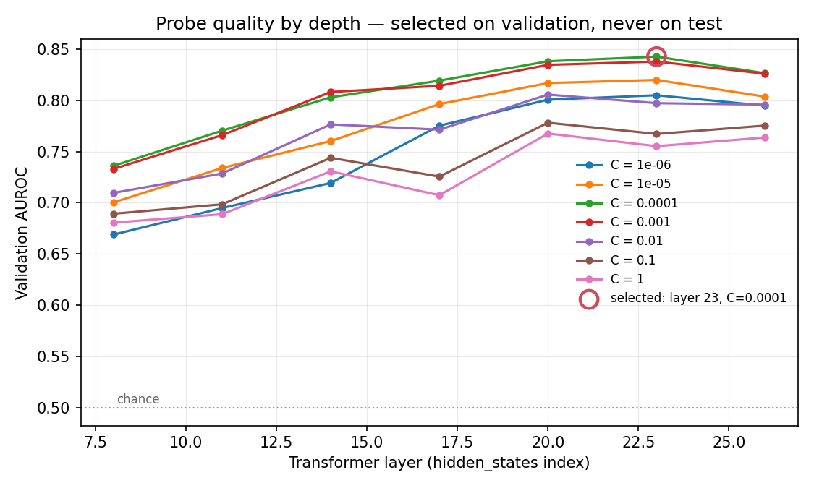

# README_TEMPLATE.md

Source for the generated `README.md`. Every `{{placeholder}}` is replaced by a value read from `results/` by `scripts/05_report.py`. **If a number cannot be traced to a file in `results/`, it does not go in.** This header block, and everything above the first `---` rule, is stripped at render time.

> Note to the agent: keep the writing plain. No marketing language, no adjectives that aren't doing work. A reviewer should be able to check every claim against an artifact in this repo within two minutes. Badges are allowed to carry numbers **only** through placeholders, so they regenerate with everything else.

---

<div align="center">

# ControlPlane — cascade economics

**Can you tell, before a language model writes a single token, whether the answer it is about to give will be wrong?**

[](https://www.python.org/)
[](https://pytorch.org/)
[](https://huggingface.co/docs/transformers)
[](https://scikit-learn.org/)
[](https://numpy.org/)
[](https://pandas.pydata.org/)
[](https://scipy.org/)
[](notebooks/)
[](tests/)
[](LICENSE)

**Measured on `{{model_name}}` ({{quantization}}) · {{device_name}}**


-{{lift}}x-2ca02c?style=flat-square)


*Accenture Innovation Challenge 2026 · Problem Statement 1 — ControlPlane.ai · Team **Dominator**, IIT Kharagpur*

</div>

---

If you can, monitoring gets much cheaper. Serious checkers — LLM-as-judge, semantic entropy, claim attribution — cost 200 to 1000 milliseconds per call, so nobody runs them on all their traffic. They sample a few percent and the rest ships unchecked. This repo measures whether a linear probe on the model's internal state can pick which few percent are worth checking.

## Contents

| | |
|---|---|
| [Result](#result) · [How it works](#how-it-works) · [The three policies](#the-three-policies) · [Layer sweep](#layer-sweep) | what we measured |
| [Repository map](#repository-map) · [Documentation](#documentation) · [Reproducing](#reproducing) | how to use it |
| [Method notes](#method-notes) · [Secondary validation](#secondary-validation) · [Limitations](#limitations) | how to challenge it |
| [Authors](#authors) · [Acknowledgements](#acknowledgements) · [Licence](#licence) | who built it |

## Result

| Metric | Value |
|---|---|
| Model | {{model_name}} ({{quantization}}) |
| Dataset | {{dataset}}, n={{n_test}} held-out questions |
| Base error rate | {{base_rate}} |
| Probe layer | {{layer}} of {{n_layers}} (selected on validation) |
| Test AUROC | {{auroc}} [{{auroc_ci_low}}, {{auroc_ci_high}}] |
| Measured flag rate `f` | {{flag_rate}} |
| Measured recall `R` | {{recall}} [{{recall_ci_low}}, {{recall_ci_high}}] |
| Precision | {{precision}} |
| **Lift (`R/f`)** | **{{lift}}×** [{{lift_ci_low}}, {{lift_ci_high}}] |

**Reading:** at the same judge budget as random sampling, the probe surfaces **{{lift}}×** as many wrong answers.

**Read that number with its ceiling.** `lift = R/f = precision / base_rate`, so precision ≤ 1 caps lift at `1/base_rate`. This test set has a base error rate of {{measured_base_rate}}, which caps lift at **{{lift_ceiling}}×** — the measured {{lift}}× is **{{lift_pct_of_ceiling}} of everything attainable here**. TriviaQA no-context is a deliberately hard benchmark; the model is wrong on nearly 40% of it, which leaves little room for any triage to beat random sampling by a wide margin.

The base error rate *assumed in the policy table below*, and the judge's accuracy, do both cancel from the ratio — the multiplier does not rest on an assumption about production error rates. That is a separate point from the ceiling above, and the two are easy to conflate.

### Headroom — projection, not measurement

A ROC curve is base-rate independent, so the measured curve can be re-read at rarer error rates at the same budget:

{{projection_table}}

> {{projection_caveat}}

## How it works

1. The model reads a question. It has generated nothing yet.
2. At layer {{layer}}, take the residual-stream vector at the final prompt token — {{hidden_size}} numbers, a by-product of the prefill pass the model performs anyway.
3. A logistic regression scores it. One dot product: **{{probe_latency_us}} µs**, against **{{generation_latency_ms}} ms** to generate the response — a factor of {{latency_ratio}}.
4. Responses above the threshold go to the expensive checker. The rest don't.

The probe never blocks anything. Its only output is a decision about where to spend a judge call, which is why it is tuned for recall and why low precision is acceptable: a false positive costs one wasted judge call, a false negative costs a user acting on a wrong answer.

## The three policies

At N = 1,000,000 responses, base error rate {{reference_error_rate}}:

| Policy | Judge calls | Responses seen by any check | Errors caught | Relative cost |
|---|---|---|---|---|
| Judge everything | 1,000,000 | 100% | {{policy_a_caught}} | {{policy_a_cost}}× |
| Random {{flag_rate_pct}}% sample | {{policy_b_calls}} | {{flag_rate_pct}}% | {{policy_b_caught}} | 1× |
| **Probe-triggered** | **{{policy_c_calls}}** | **100%** | **{{policy_c_caught}}** | **1×** |

Coverage and verdict are different things. Every response passes the cheap layers; the expensive verdict is what's rationed. Random sampling has {{flag_rate_pct}}% coverage *and* {{flag_rate_pct}}% verdict. That gap is the whole result.

## Layer sweep

{{layer_sweep_table}}



Validation AUROC by depth. The layer was chosen here, on validation. Test played no part in the choice.

## Repository map

Five stages, each a separate process that writes to `results/` and reads the previous stage's output from disk — so any stage can be re-run without repeating the GPU-hour extraction.

```
config.yaml            every knob; nothing in src/ hardcodes a value
src/                   all logic lives here
  config.py            config loading, seeding, provenance, config hashing
  data.py              TriviaQA loading, dedup, question-level splits, labelling
  model.py             model + tokenizer loading, NF4, chat templating, padding guard
  extract.py           question-time activation extraction, generation, base-rate gate
  probe.py             standardisation, logistic regression, layer x C sweep
  evaluate.py          AUROC, precision, recall, bootstrap CIs, test-scoring log
  economics.py         three-policy comparison, lift, ceiling, projections
  latency.py           probe cost vs generation cost
  report.py            renders results/ into RESULTS.md, README.md, HANDOVER.md, plots
scripts/               argument parsing and file writing only, no logic
  01_extract.py        -> activations.npz, labels.parquet, splits.parquet, *_meta.json
  02_train_probe.py    -> probe_sweep.json, probe.joblib, probe_test.json
  03_economics.py      -> economics.json
  04_latency.py        -> latency.json
  05_report.py         -> RESULTS.md, README.md, layer_sweep.png, roc_curve.png
  06_handover.py       -> docs/HANDOVER.md
  run_all.py           orchestrates 01 -> 05
  build_notebooks.py   regenerates both notebooks from source
tests/                 one suite per invariant, not per happy path
notebooks/
  cascade_economics.ipynb   presentation wrapper over src/, outputs committed
  run_on_kaggle.ipynb       GPU runner with stage gates and a pre-flight
results/               committed as JSON + markdown + plots; activations are not
```

Every artifact in `results/` embeds the resolved config, its SHA-256 hash, the git commit, library versions, device, and a UTC timestamp. That is what makes a number in this README checkable rather than claimed.

## Documentation

| Document | What it answers |
|---|---|
| [docs/HANDOVER.md](docs/HANDOVER.md) | *Start here.* What was built, what the numbers mean, what to say and not say when presenting. Generated from `results/`. |
| [docs/ARCHITECTURE.md](docs/ARCHITECTURE.md) | How the pipeline fits together — stage boundaries, artifact contracts, where each invariant is enforced in code. |
| [docs/SETUP.md](docs/SETUP.md) | Getting it running: laptop, Kaggle/Colab T4, offline cluster. Plus the failure modes and what they mean. |
| [docs/FAQ.md](docs/FAQ.md) | The questions a technical reviewer actually asks, each answered with the artifact that settles it. |
| [docs/GLOSSARY.md](docs/GLOSSARY.md) | `lift`, `f`, `R`, question-time activation, cascade, trigger vs verdict — defined once, precisely. |
| [results/RESULTS.md](results/RESULTS.md) | The formal record: every table, every interval, every disclosure. Generated. |
| [DECISIONS.md](DECISIONS.md) | Append-only log of every methodological choice a reviewer could challenge, with the alternatives rejected. |
| [SPEC.md](SPEC.md) · [CLAUDE.md](CLAUDE.md) · [TASKS.md](TASKS.md) | The contracts: technical specification, invariants, staged build order. |
| [CONTRIBUTING.md](CONTRIBUTING.md) | Git and documentation workflow. Binding. |

## Reproducing

```bash
pip install -r requirements.txt

python -m pytest tests/ -q                               # no GPU, no downloads
python scripts/run_all.py --config config.yaml --smoke   # ~5 min, n=100
python scripts/run_all.py --config config.yaml           # full run, needs a GPU
python scripts/run_all.py --from 02                      # reuse saved activations
```

Runs on a single 16GB GPU with NF4 quantisation. Free Colab or Kaggle T4 is sufficient. Full run: {{total_runtime}} on {{device_name}}. Everything after extraction runs on a laptop in about a minute — see [docs/SETUP.md](docs/SETUP.md).

Offline clusters: pre-download the model and dataset into `HF_HOME` on a login node, then set `HF_HUB_OFFLINE=1` and `HF_DATASETS_OFFLINE=1`.

## Method notes

**Question-time probing.** Activations come from the last prompt token before generation. Not mid-generation, not from the answer. This is what makes the signal usable as a pre-generation router as well as a monitor.

**Splitting.** By `question_id`, after deduplicating normalised question strings. TriviaQA ships answer aliases and some near-duplicate questions; splitting at example level leaks them across train and test and inflates AUROC.

**Selection discipline.** Layer, regularisation strength, and threshold were all chosen on validation; test was never consulted for any of them. Every scoring of the test set is logged and published — see `results/test_scoring_log.json` and `DECISIONS.md` 016-017, which pre-registers the one re-scoring and reports its outcome.

**Labelling.** Greedy decoding, then normalised alias matching (lowercase, strip punctuation, drop articles). Aliases under 3 characters require a whole-token match rather than substring containment. Strict exact match is reported alongside as an audit: {{strict_em_base_rate}} vs {{base_rate}} lenient.

**Uncertainty.** 1000-sample bootstrap, 95% percentile intervals.

**The failure this pipeline is built to catch.** With right padding, position −1 of a batch is a pad token, every activation is meaningless, nothing raises, and the AUROC lands near 0.5 — reading as "the idea doesn't work". So every run measures one batch twice, once correctly and once deliberately right-padded, and **fails unless the broken one is rejected**. Both rows are published in `results/RESULTS.md` §1.

## Secondary validation

When the model abstains ("I don't know"), mean probe score is {{abstain_score}} against {{non_abstain_score}} for non-abstaining responses (AUROC {{abstain_auroc}}, abstention rate {{abstain_rate}}). The direction tracks the model's own expressed uncertainty as well as its correctness — independent evidence the probe reads something real rather than a dataset artifact.

{{negative_control_section}}

## Limitations

- **One model, one dataset.** {{model_name}} on TriviaQA. Cross-model and cross-dataset generalisation is untested here.
- **Knowledge questions only.** The published result reports that this method's generalisation falters on mathematical reasoning. {{negative_control_note}}
- **This measures the probe, not a system.** No gateway, no serving path, no end-to-end latency under load. The latency figures are component measurements.
- **`f` depends on workload.** The flag rate reported here is for this dataset at this threshold. Real traffic has a different difficulty distribution.
- **Judge accuracy is assumed to cancel.** It does cancel from the ratio, but a real judge misses errors the probe correctly flagged, so absolute errors-caught counts are upper bounds.
- **Single seed** unless a seed sweep is reported above.
- **Labelling is automatic.** Normalised alias matching is a proxy for correctness, not human judgment.
- **The probe tier needs weight access.** An enterprise consuming a model through a vendor API cannot read its activations. The cascade still applies; the probe tier specifically does not. Say so before a reviewer does.

## Authors

Team **Dominator** — Indian Institute of Technology Kharagpur.

| | Author | Programme |
|---|---|---|
| 🧑‍💻 | **Aditya Singh** — [@Aditya26189](https://github.com/Aditya26189) | Mechanical Engineering, 2028 |
| 🧑‍💻 | **Krishnakant Sahu** — [@kksahu444](https://github.com/kksahu444) | Computer Science & Engineering, 2027 |
| 🧑‍💻 | **Upendra Singh** | Mechanical Engineering, 2028 |

Per-author contribution is in `git log` and the repository's contributors graph, which are authoritative; this table is not a claim about who wrote which line.

## Acknowledgements

The method reproduced here follows the question-time probing result reported in [arXiv:2509.10625](https://arxiv.org/abs/2509.10625), including its documented limitation on mathematical reasoning (`DECISIONS.md` 001, 008). Built on `Qwen/Qwen2.5-7B-Instruct`, `mandarjoshi/trivia_qa`, and the Hugging Face, PyTorch and scikit-learn stacks — all open weights and permissive licences, which is a requirement here rather than a preference: the probe tier only exists where the weights can be inspected.

## Licence

MIT — see [LICENSE](LICENSE).
