# DIAGRAMS.md — the system in pictures

Eleven diagrams, in the order a reader needs them: what the system *is*, how
a number gets made, what happens to it afterwards, how the repository proves any
of it, and where every directory sits. Every diagram names the code it describes.

These render natively on GitHub. Nothing here carries a measured number — the
numbers live in [README.md](../README.md)'s claim table and in `results/`,
which is where a reader should check them.

**Contents:** [1 The three objects](#1-the-three-objects) · [2 The pipeline](#2-the-pipeline-stage-by-stage) · [3 Warrant lifecycle](#3-the-warrant-lifecycle) · [4 A validation run](#4-what-happens-inside-one-validation-run) · [5 The five controls](#5-the-five-controls) · [6 Policy](#6-policy-reads-the-warrant-not-the-score) · [7 Composition](#7-composing-two-detectors) · [8 Drift](#8-drift-and-the-revocation-ladder) · [9 Verification](#9-how-the-repository-proves-itself) · [10 The journey](#10-what-we-built-round-1-to-round-2) · [11 The repository](#11-the-repository-end-to-end)

---

## 1. The three objects

The whole system is one sentence: **a detector produces a score, a warrant says
what that score is worth on a named distribution, and policy reads the warrant
rather than the score.**

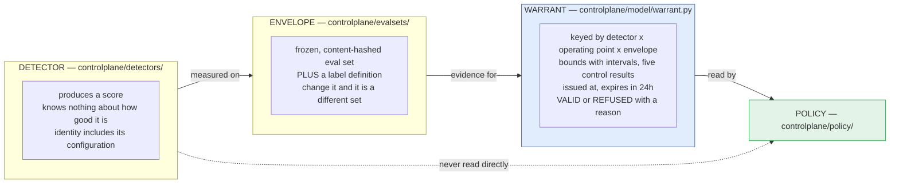

The dotted line is the point of the project. A conventional stack draws it
solid: policy thresholds a raw score, and a detector that quietly stopped
working looks exactly like one that works.

**Why the detector's identity includes its config:** `presidio-stock` and
`presidio-enabled` are two detectors, not one detector with a flag. A shared id
would let a warrant measured on one be quoted for the other.

---

## 2. The pipeline, stage by stage

Each stage is a separate process that writes to `results/` and reads the
previous stage's output from disk. Only the first needs a GPU.

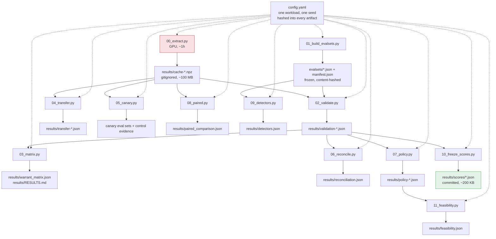

Stages `12`–`15` and `17` are the banking pilot and the Presidio coverage
claim; they hang off the same config and write their own artifacts. Full list
with flags in [RUNBOOK.md](RUNBOOK.md).

**The green box is why a stranger can check this repository.** `results/scores/`
holds the per-item labels, scores and question ids behind every measured block.
It is small enough to commit, so `make verify` can recompute every metric on a
fresh clone with no GPU and no cache.

---

## 3. The warrant lifecycle

Three states, three behaviours, and `UNVALIDATED` never collapses into either
of the others.

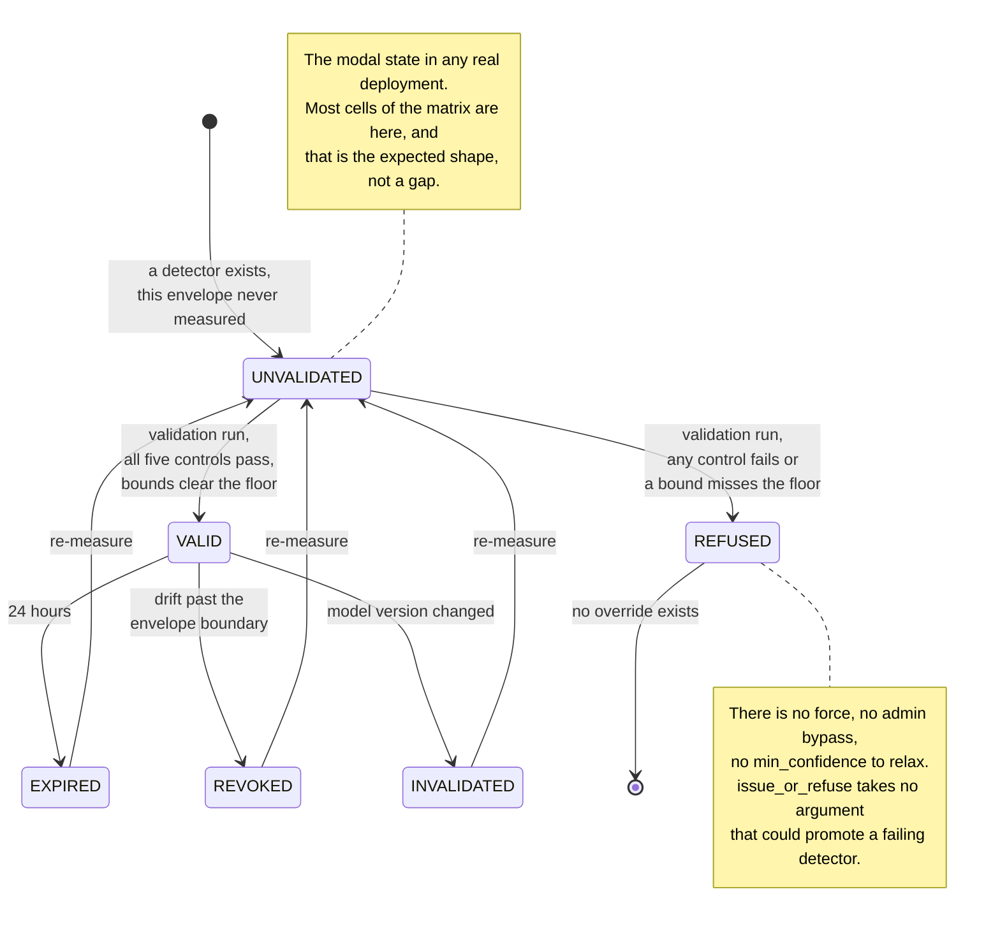

A system that cannot say *"this detector has never been measured on this
distribution"* will instead say something confident and wrong.

`controlplane/model/warrant.py`, `controlplane/validation/issuance.py`

---

## 4. What happens inside one validation run

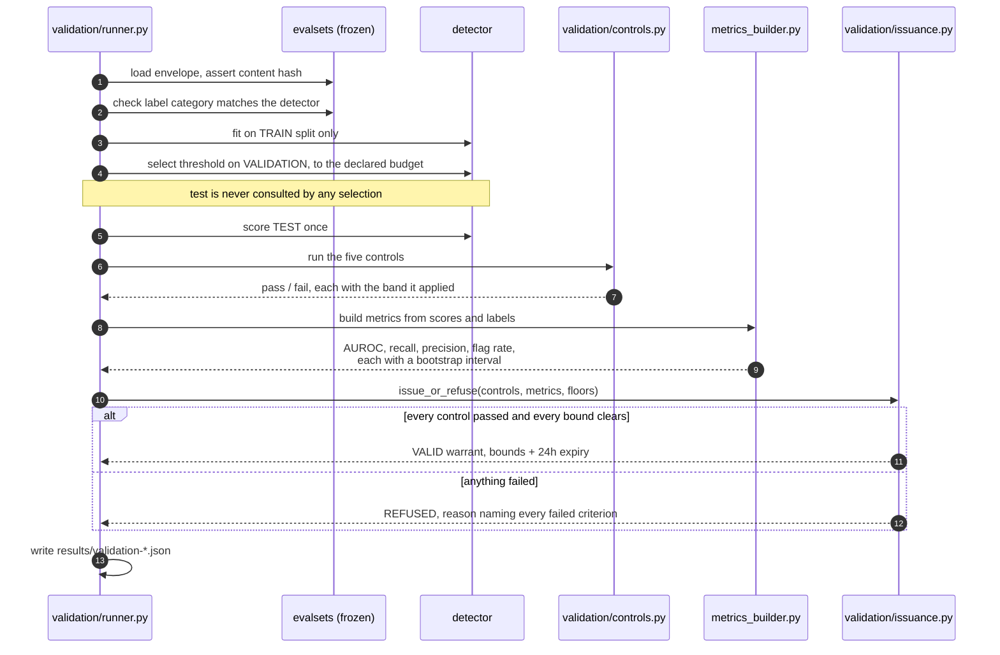

The scaler is fit on train indices only, and the bootstrap resamples over
`question_id` rather than rows — TriviaQA ships several items per question, and
a row-level bootstrap would treat correlated items as independent and produce
intervals that are too narrow. [METHODS.md](METHODS.md) §1.

---

## 5. The five controls

Every validation runs all five. **Any failure refuses the warrant**, and
nothing downstream can promote it back.

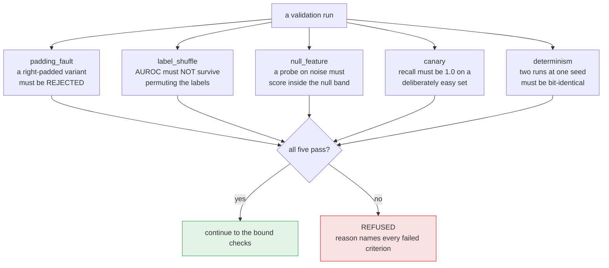

**The control that must fail to pass.** `padding_fault` deliberately builds a
right-padded variant and requires the check to *reject* it. Without that, a
tolerance loosened until the check passed is indistinguishable from a check
that works. With right padding, position −1 of a batch is a pad token, every
activation is meaningless, nothing raises, and AUROC lands near chance — which
reads as "the idea doesn't work" rather than "the code is broken".

**The null band is measured, not looked up.** The Hanley–McNeil closed form
understates the true spread here, because a fitted probe's scores are not
exchangeable under label permutation, so each control simulates its own null at
construction and reports the band it applied. `DECISIONS.md` 029, 031, 070.

---

## 6. Policy reads the warrant, not the score

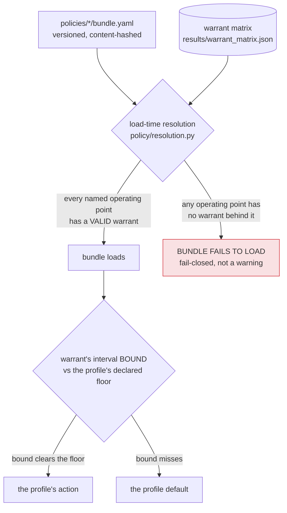

Two things in that diagram are load-bearing:

- **The comparison uses the interval bound, not the point estimate.** A point
  estimate that clears a floor with an interval straddling it has not cleared
  anything.
- **A bundle naming an operating point with no warrant does not load.** Not a
  warning, not a default — a load failure. `controlplane/policy/errors.py`

The three profiles — `customer_support`, `internal_knowledge`,
`decision_support` — are **three points on one measured ROC**, not three
invented thresholds. Same detector, same envelope; only the flag-rate budget
moves.

---

## 7. Composing two detectors

Two warranted detectors, one decision. The rules were written before the code
(`DECISIONS.md` 088).

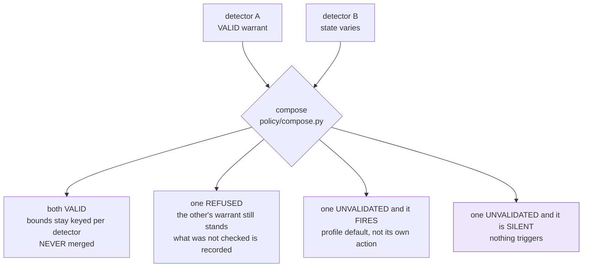

Case 4 is the one people get wrong. **Silence from an unmeasured detector is
not evidence.** Two detectors agreeing does not strengthen either bound either —
it is not a vote, and the bounds are never merged. All four cases are
enumerated with their tests in [CASES.md](CASES.md) §2.

---

## 8. Drift and the revocation ladder

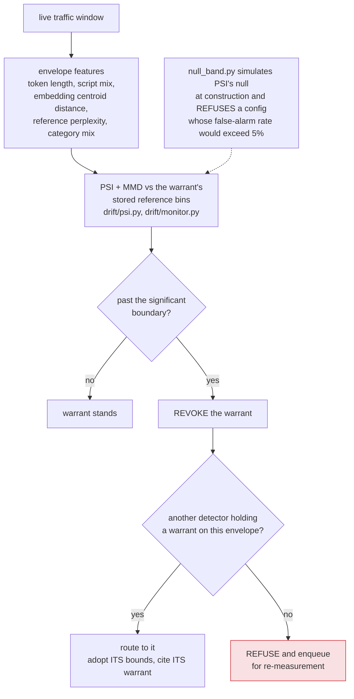

PSI's 0.10 / 0.25 bands are credit-scoring rules of thumb quoted without their
sample size, and they are not scale-free — the null grows as `(k−1)/n`. A
threshold that fires on 30% of stable windows is not a monitor; it is noise with
a dashboard. `DECISIONS.md` 070.

The measured demonstration is one long-context shift across three probe
aggregations with nothing retrained: last-token holds its warrant, mean-pool
collapses to chance and **flags nothing** — which a conventional dashboard reads
as clean traffic. That is the failure this system exists to name.
[ARCHITECTURE.md](ARCHITECTURE.md), "Drift".

---

## 9. How the repository proves itself

`make verify` is the "prove it" button. Three checks, weakest first, each
proving something the one before it cannot.

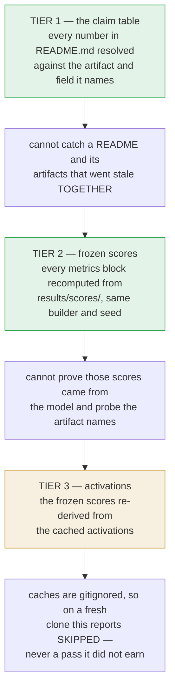

All three exit non-zero on drift, and **nothing in `results/` is written by any
of them** — the re-run goes to a scratch directory, so a failed verification
cannot damage the evidence it was checking.

Running order for a newcomer: `make smoke` (under a minute), `make verify`
(a few minutes), `make test`. See [SETUP.md](SETUP.md).

---

## 10. What we built, Round 1 to Round 2

The step-by-step of the project itself. Round 1 measured one detector; Round 2
built the layer that says what any detector's number is worth.

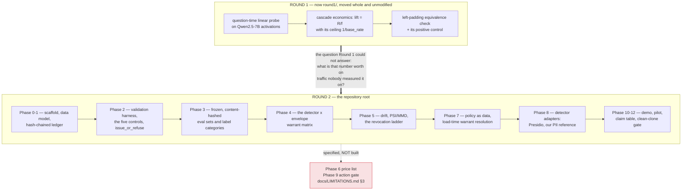

Two things that diagram is deliberately honest about:

- **Phase 6 and Phase 9 were specified and never written.** Every cost,
  headcount or ROI figure in this repository is therefore a declared estimate
  and says so. The feasibility bound is the exception — it derives from measured
  rates and needs no cost model.
- **The move is audited.** Round 1 became `round1/` and Round 2 became the root
  via `git mv`, so `git log --follow` reaches the original commits through every
  rename. The mapping is in [PATHS.md](PATHS.md).

The narrative version, with what each phase cost and what it changed, is in
[JOURNEY.md](JOURNEY.md).

---

## 11. The repository, end to end

Every directory, what is in it, and which way the arrows point. This is the map
to open beside a first clone.

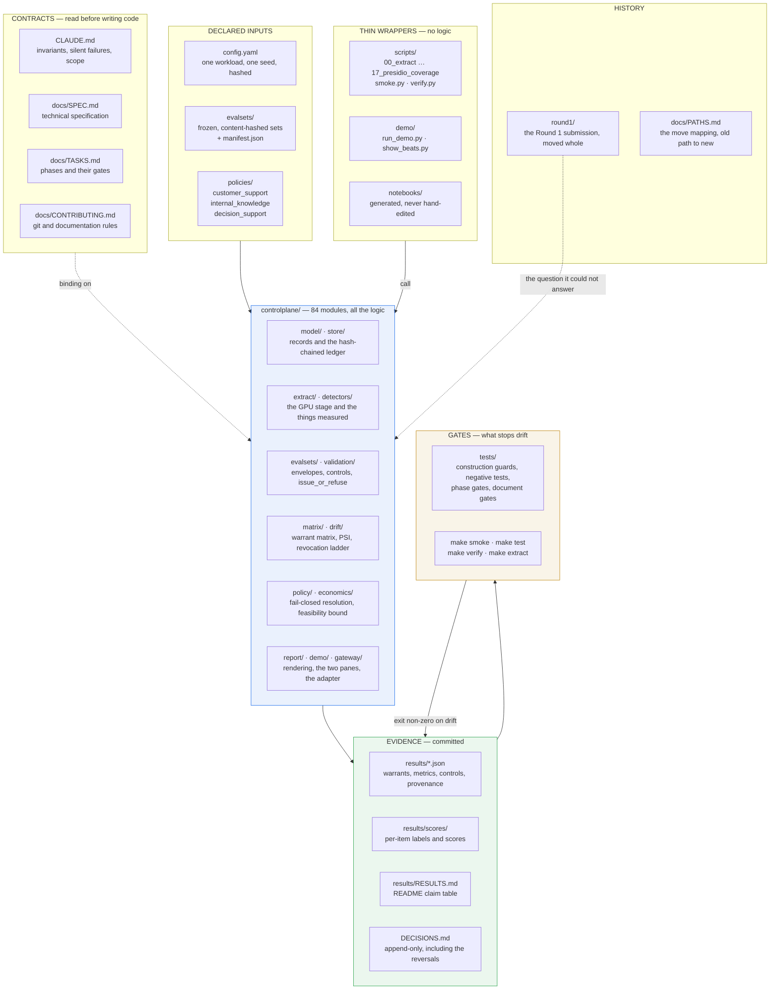

Three things that diagram is saying, and they are the shape of the whole
project:

- **Logic only lives in the middle box.** Scripts, notebooks and the demo runner
  call into it. Logic that lives only in a script is unreviewable, and logic that
  lives only in a notebook cannot be run in CI.
- **Evidence and gates point at each other.** The artifacts are checked by the
  gates, and the gates exit non-zero rather than warning. That loop is why a
  number in this repository is checkable rather than asserted.
- **Round 1 is history, not a dependency.** It is preserved whole because the
  question it could not answer is the reason Round 2 exists.

---

**See also:** [ARCHITECTURE.md](ARCHITECTURE.md) for the prose version ·
[CODE_TOUR.md](CODE_TOUR.md) for the module behind each box ·
[GLOSSARY.md](GLOSSARY.md) for any term above that is doing more work than it
looks like.
