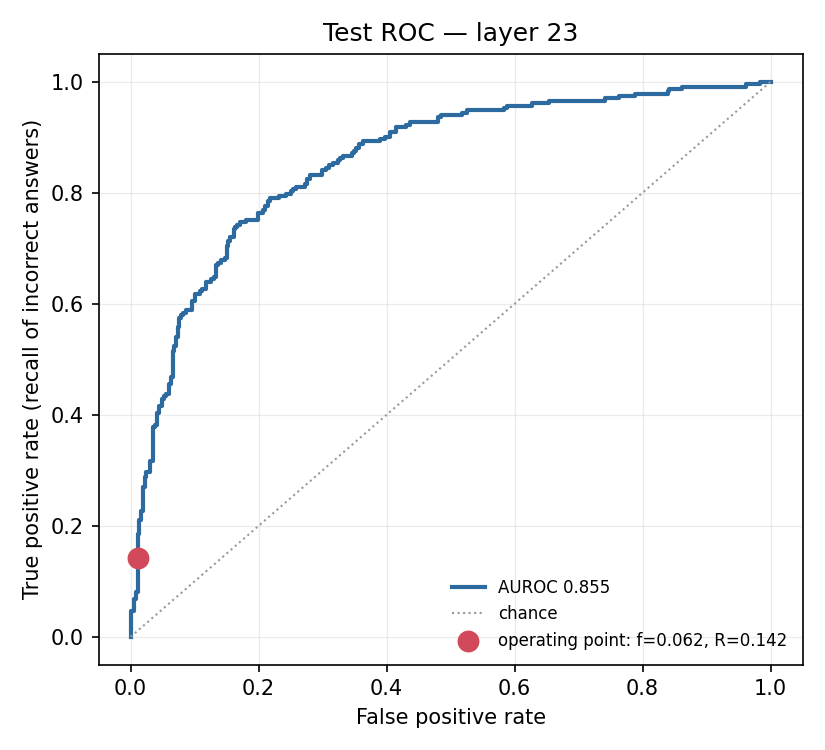

# Handover — cascade economics

*Generated by `scripts/06_handover.py` from `results/`. Every number here is read from an artifact; none is typed by hand.*

**What this is.** We measured whether a linear probe on a model's internal state, read *before it generates a single token*, can pick which responses are worth spending an expensive checker on. It can. This page is what that means, what bounds it, and how to talk about it.

`Qwen/Qwen2.5-7B-Instruct` · NF4 · Tesla T4 · seed 1729 · config `c429ce5e92da9a22` · commit `6a77b3e`

---

## 1. The result

| | Value | 95% CI |
|---|---|---|
| Test AUROC | **0.8551** | [0.8217, 0.8878] |
| Lift (`R/f`) | **2.30×** | [2.02, 2.63] |
| Ceiling on this data | 2.58× | we reached 89.2% |
| Probe cost | 229 µs | vs 2.6 s to generate |

**Read the lift with its ceiling — this is the one thing not to misquote.** `lift = R/f = precision / base_rate`, and precision cannot exceed 1, so lift is capped at `1/base_rate`. The model is wrong on 38.8% of this benchmark, capping lift at 2.58× for *any* probe. We reached 89.2% of what was available.

The transferable quantity is therefore the **AUROC**, not the lift. The lift is what that ranking quality is worth on a workload where the model fails this often.

> **How to quote it**
> 
> "2.30× more errors caught at the same judge budget — which is 89% of the maximum this benchmark allows."
> 
> The second clause is not a hedge. Without it the number looks weak; with it, it reads as near-optimal on a hard test.

## 2. What it actually does

A model reads a question and has generated nothing yet. At layer 23 of 28, we take the residual-stream vector at the final prompt token — 3,584 numbers that fall out of the prefill pass the model performs anyway. A logistic regression scores it. Responses above a threshold go to the expensive checker; the rest don't.

The probe is a **trigger, not a verdict**. It never blocks anything, which is why it is tuned for recall and why low precision would be acceptable: a false positive wastes one judge call, a false negative lets a user act on a wrong answer.

It adds **no extra forward pass**. The quoted 229 µs is the full scikit-learn call; the arithmetic alone is 7.7 µs. We quote the slower figure deliberately — it is the conservative one.

| Policy | Judge calls | Responses seen by any check | Errors caught | Relative cost |
|---|---|---|---|---|
| Judge everything | 1,000,000 | 100% | 30,000 | 16x |
| Random 6.2% sample | 61,667 | 6.16667% | 1,850 | 1x |
| **Probe-triggered** | **61,667** | **100%** | **4,249** | **1x** |

All three policies spend the same judge budget. Coverage and verdict are different things, and that gap is the whole result.

## 3. Why believe it

The failure that would have quietly ruined this experiment is padding. With right padding, position −1 of a batch is a pad token, every activation is meaningless, nothing raises an error, and you get an AUROC near 0.5 that reads as "the idea doesn't work".

So every run measures the same batch twice — once correctly, once **deliberately broken** — and requires the broken one to fail:

| Padding | Relative L2 | Cosine | Verdict |
|---|---|---|---|
| Left (correct) | 1.556e-02 | 0.999880 | accepted |
| Right (deliberate fault) | 1.278 | 0.1414 | **rejected** |

Limits are relative L2 ≤ 0.1 and cosine ≥ 0.999, sitting far from both regimes. This turns the check from "it passed" into "it still rejects the fault it exists for, on this hardware".

**Selection discipline.** Layer, regularisation strength and threshold were all chosen on validation; test was never consulted for any of them. It has been scored 3 times in total — once before the audit log existed, and every scoring is published, with the one re-scoring pre-registered in `DECISIONS.md` 016 before it ran.

Splits are by question, after removing 7,983 duplicate questions from 17,944 rows. That dedup matters: roughly 80% of questions in this dataset appear twice, so an example-level split would have put the same question in train and test.

## 4. The measurements

Selected **layer 23, C = 0.0001** on validation AUROC 0.8425. The winner sits *inside* the grid (`winner_at_grid_boundary` = False); an earlier run picked the smallest value at every layer, meaning the search had hit a wall rather than found an optimum (`DECISIONS.md` 016, 017).




At the frozen threshold on 600 held-out questions: 33 true positives, 4 false positives, 200 missed, 363 correctly passed. Base error rate 0.3883.

Extraction ran 3,000 examples in 2h 19m at 0.36 examples/s.

Full tables, bootstrap intervals and the base-rate projection are in [`results/RESULTS.md`](../results/RESULTS.md).

## 5. What this does not show

> **The sharpest question you will be asked**
> 
> "Enterprises use models through an API. You can't read activations through an API." Correct, and it needs answering head-on: the probe tier requires weight access. The *cascade* generalises — where you don't own the weights, the cheap tier degrades to output-layer signals. Don't claim universality.

- **The headline lift is bounded by this benchmark, not by the probe.** `lift = precision / base_rate`, so a base error rate of 0.3883 caps it at 2.58x however well the probe ranks. The measured value reaches 89.2% of that. The transferable quantity is the AUROC; the lift is specific to a workload where the model is wrong this often (DECISIONS.md 015).
- **One model, one dataset.** `Qwen/Qwen2.5-7B-Instruct` on mandarjoshi/trivia_qa (rc.nocontext). Cross-model and cross-dataset generalisation is untested here.
- **Knowledge questions only.** The published result reports that generalisation falters on mathematical reasoning; the GSM8K control was not run, so that boundary is cited here rather than measured.
- **This measures the probe, not a system.** There is no gateway, no serving path, and no end-to-end latency under load. The latency figures are component measurements taken in isolation.
- **`f` depends on workload.** The flag rate of 0.0617 is for this dataset at this threshold. Real traffic has a different difficulty distribution and would produce a different rate at the same threshold.
- **Judge accuracy is assumed to cancel.** It does cancel from the ratio, but a real judge misses errors the probe correctly flagged, so the absolute errors-caught counts in the three-policy table are upper bounds.
- **Single seed.** Everything reported is at seed 1729. No seed sweep was run, so the intervals reflect test-set sampling only, not variation in the split or in probe fitting.
- **Labelling is automatic.** Normalised alias matching is a proxy for correctness, not human judgment. Lenient and strict matching differ by 0.488 in accuracy here.
- **Test set is small.** 600 examples, which is why every headline number carries a bootstrap interval rather than a point estimate alone.

## 6. If you're presenting this

**Say**

- "The probe ranks wrong answers at AUROC 0.855. At a 6% judge budget that's 2.3× more errors than random sampling — 89% of the ceiling this benchmark allows."
- "It costs 229 microseconds against a 2.6 second generation, and adds no forward pass."
- "We deliberately broke the padding to prove the check still catches it."

**Don't say**

- "2.3× better than random" — without the ceiling it sounds weak rather than near-optimal.
- "It works on any model" — it needs weight access. Say so before someone else does.
- "This catches hallucinations" — it is a correlational classifier over activations, not a truth detector.

## 7. What's still open

- **The API-access design note.** The cascade with the probe as one tier, and what the cheap tier becomes without weights. Fastest of the three, and it decides whether the rest is taken seriously.
- **Policy layer and tiered decisions.** One measured ROC, different operating points per use case — a customer-facing bot and an internal copilot want different budgets on the same curve. Needs no new science.
- **GSM8K negative control.** Published work says this method falters on mathematical reasoning; reproducing that deliberately is more credible than citing it.

## Reproducing

```bash
pip install -r requirements.txt
python -m pytest tests/ -q                      # no GPU, no downloads
python scripts/run_all.py --from 02             # ~1 min from saved activations
python scripts/run_all.py --config config.yaml  # full run, needs a GPU
```

Everything except extraction runs on a laptop. The full run needs a free Kaggle T4 for about 2.3 hours; `notebooks/run_on_kaggle.ipynb` walks through it.

Methodology and every contested choice are logged in [`DECISIONS.md`](../DECISIONS.md); the invariants are in [`CLAUDE.md`](../CLAUDE.md).
