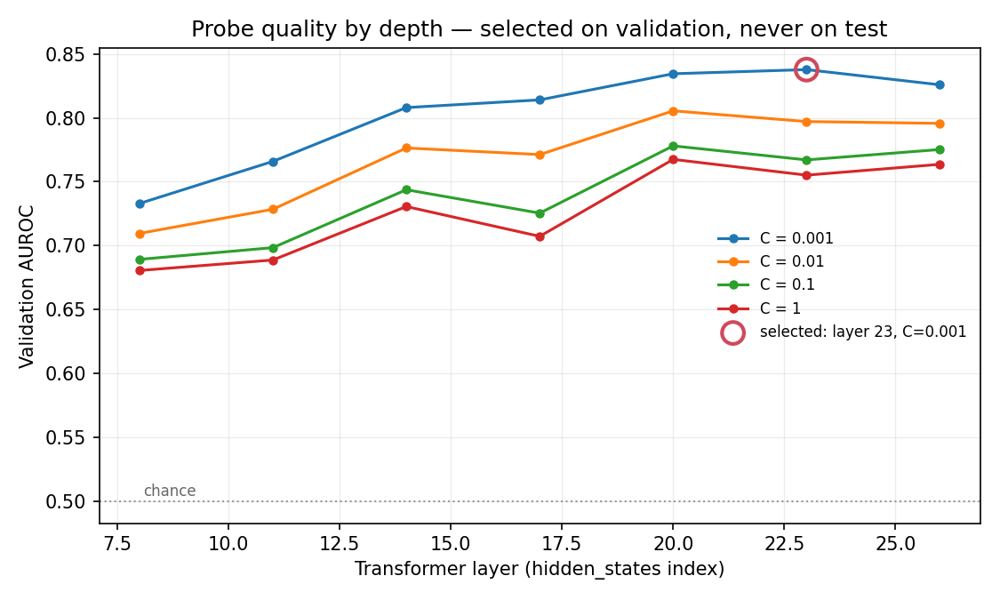
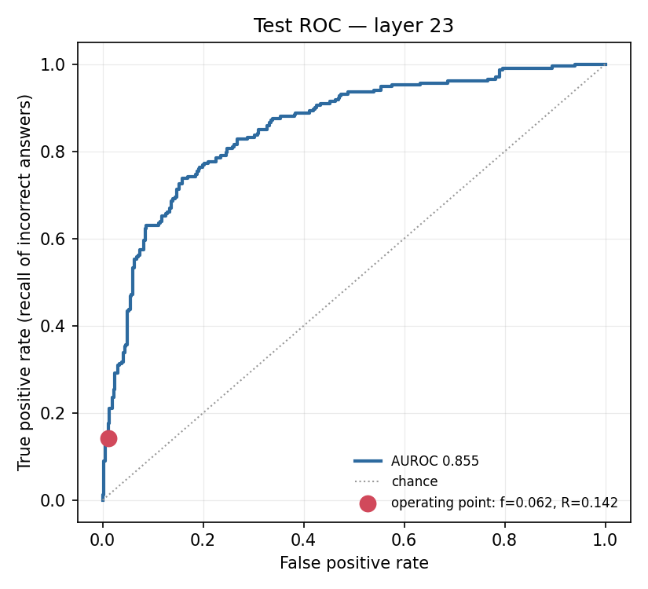

# RESULTS

Generated by `scripts/05_report.py`. Every number below is read from a JSON artifact in this directory; none is hand-entered.

## 1. Run metadata

| Field | Value |
|---|---|
| Model | `Qwen/Qwen2.5-7B-Instruct` |
| Quantisation | nf4 (bfloat16 compute) |
| Device | Tesla T4 |
| Seed | 1729 |
| Config hash | `cbac792afcf74bc3` |
| Git commit | `bec7f865e4b5b224aff8923fd6b728b11c9cb3e4` |
| Working tree dirty at run time | True |
| Timestamp (UTC) | 2026-08-21T15:14:39+00:00 |
| torch / transformers | 2.10.0+cu128 / 5.0.0 |

Left-padding equivalence check: relative L2 error **1.556e-02** (limit 1e-01), cosine similarity **0.999880** (limit 0.9990), across 4 prompts spanning the length distribution. Batched and unbatched last-token activations agree, so position -1 is the true final prompt token and not a pad token (CLAUDE.md invariant 4).

Positive control: repeating the same comparison with the tokenizer deliberately **right**-padded gives relative L2 1.278e+00 and cosine 0.1414 — rejected, as it must be. The check is therefore demonstrated to discriminate a real padding fault on this model and this hardware, not merely to have passed.

## 2. Dataset

| Field | Value |
|---|---|
| Source | `mandarjoshi/trivia_qa`, config `rc.nocontext`, split `validation` |
| Rows loaded | 17,944 |
| Dropped as duplicate questions | 7,983 |
| Dropped as empty or aliasless | 0 |
| Sampled | 3,000 |
| Split sizes | train 1,800 / val 600 / test 600 |
| Accuracy (lenient alias match) | 0.594 |
| Accuracy (strict exact match) | 0.106 |
| **Base error rate (positive class)** | **0.406** |

Splits are by `question_id` after deduplicating normalised question strings, and are asserted pairwise disjoint on both keys (CLAUDE.md invariant 3).

**Labelling note.** Lenient and strict matching disagree by 0.488 in accuracy, more than the ~10 point threshold SPEC.md §2 asks to be called out. The lenient rule is primary (DECISIONS.md 007); the gap is the amount of correctness attributable to a gold alias appearing inside a longer sentence.

## 3. Layer sweep — validation AUROC

| Layer | C=0.001 | C=0.01 | C=0.1 | C=1 |
|---|---|---|---|---|
| 8 | 0.7330 | 0.7096 | 0.6893 | 0.6806 |
| 11 | 0.7659 | 0.7285 | 0.6985 | 0.6888 |
| 14 | 0.8080 | 0.7764 | 0.7438 | 0.7306 |
| 17 | 0.8140 | 0.7712 | 0.7255 | 0.7073 |
| 20 | 0.8344 | 0.8054 | 0.7781 | 0.7675 |
| 23 | **0.8377** | 0.7971 | 0.7671 | 0.7552 |
| 26 | 0.8258 | 0.7956 | 0.7752 | 0.7636 |

**Selected: layer 23 of 28, C = 0.001**, on validation AUROC 0.8377. The layer, the regularisation strength and the threshold were all chosen here. The test set was opened afterwards, once (CLAUDE.md invariant 2, DECISIONS.md 006).

## 4. Test results

The test set was scored exactly once, at n = 600.

| Metric | Value | 95% CI |
|---|---|---|
| AUROC | 0.8545 | [0.8219, 0.8869] |
| Measured flag rate `f` | 0.0617 | [0.0433, 0.0817] |
| Recall `R` | 0.1416 | [0.0996, 0.1881] |
| Precision | 0.8919 | [0.7837, 0.9756] |
| Base error rate | 0.3883 | — |

Confusion at the frozen threshold (2.7940): TP 33, FP 4, FN 200, TN 363. 37 of 600 responses flagged; 233 were incorrect.

Precision and recall are reported separately and never blended (CLAUDE.md invariant 5). Low precision is by design: a false positive costs one wasted judge call, a false negative costs a user acting on a wrong answer (DECISIONS.md 005).

The threshold was chosen on validation to hit a flag rate of 0.050 and achieved 0.050 there. On test the measured rate is 0.0617, and **that measured value is what every calculation below uses** (CLAUDE.md invariant 6).

## 5. Three policies at N = 1,000,000

Assumed base error rate 0.030 (illustrative), judge accuracy 1.00.

| Policy | Judge calls | Responses seen by any check | Errors caught | Relative cost |
|---|---|---|---|---|
| Judge everything | 1,000,000 | 100% | 30,000 | 16x |
| Random 6.2% sample | 61,667 | 6.16667% | 1,850 | 1x |
| **Probe-triggered** | **61,667** | **100%** | **4,249** | **1x** |

Coverage and verdict are different things. Every response passes the cheap probe; only the expensive verdict is rationed. Random sampling has 6.2% coverage *and* 6.2% verdict. That gap is the result.

## 6. Headline — lift

### lift = R / f = 2.30x [2.02, 2.65]

At the same judge budget as random sampling, the probe surfaces **2.30x** as many wrong answers.

**`R/f` is independent of the base error rate and of the judge's own accuracy.** Both appear in every policy's errors-caught figure and cancel from the ratio, so the multiplier does not rest on an assumption about how often the model is wrong or about how good the judge is.

Demonstrated, not asserted: recomputing the table across error rates [0.01, 0.03, 0.1, 0.5] and judge accuracies [0.5, 0.8, 1.0] gives 12 lifts with a spread of 8.9e-16 (all equal: True).

The interval is a 95% percentile bootstrap over 1,000 resamples of the 600 test examples, resampling recall and flag rate jointly because lift is their ratio.

## 7. Latency

| Measurement | Value |
|---|---|
| Probe score, median (full scikit-learn call) | 258.5 µs |
| Probe score, p95 | 334.3 µs |
| — of which arithmetic (standardise + dot + bias) | 8.5 µs |
| Generation, median per response | 2518.4 ms |
| Prefill, median per response | 353.2 ms |
| Probe / generation | 1.03e-04 |
| Probe / prefill | 7.32e-04 |
| Device | Tesla T4 |
| torch | 2.10.0+cu128 |
| Quantisation | nf4 |

**The probe adds no additional forward pass.** The activation is a by-product of the prefill that generation already performs, so its marginal cost is the scale-and-dot-product timed above and nothing else.

The headline figure is the whole scikit-learn call. Most of it is input validation and array copying, not arithmetic: the dot product itself is 30.3x faster. The slower, deployable number is quoted as the headline on purpose.

Extraction throughput for reference: 3,000 examples in 2h 18m (0.36 examples/s) at batch size 8.

## 8. Secondary validation — abstention correlation

Abstention rate on test is 0.0000 (0 of 600), below the 0.02 floor. **The comparison is underpowered and is not reported as a result** (SPEC.md §9).

## 9. Negative control — reproducing a documented limitation

Not run — **and not implemented in this build**. The published result reports that probe generalisation falters on mathematical reasoning (DECISIONS.md 008), and reproducing that on GSM8K is Stage 6 of `TASKS.md`: an optional stage that requires a completed main run first. The `negative_control` block in `config.yaml` reserves the settings for it, but no code reads them yet, so setting `enabled: true` does nothing today. Until Stage 6 is built and run, cross-domain generalisation is untested here and is listed as a limitation below.

## 10. Limitations

- **One model, one dataset.** `Qwen/Qwen2.5-7B-Instruct` on mandarjoshi/trivia_qa (rc.nocontext). Cross-model and cross-dataset generalisation is untested here.
- **Knowledge questions only.** The published result reports that generalisation falters on mathematical reasoning; the GSM8K control was not run, so that boundary is cited here rather than measured.
- **This measures the probe, not a system.** There is no gateway, no serving path, and no end-to-end latency under load. The latency figures are component measurements taken in isolation.
- **`f` depends on workload.** The flag rate of 0.0617 is for this dataset at this threshold. Real traffic has a different difficulty distribution and would produce a different rate at the same threshold.
- **Judge accuracy is assumed to cancel.** It does cancel from the ratio, but a real judge misses errors the probe correctly flagged, so the absolute errors-caught counts in the three-policy table are upper bounds.
- **Single seed.** Everything reported is at seed 1729. No seed sweep was run, so the intervals reflect test-set sampling only, not variation in the split or in probe fitting.
- **Labelling is automatic.** Normalised alias matching is a proxy for correctness, not human judgment. Lenient and strict matching differ by 0.488 in accuracy here.
- **Test set is small.** 600 examples, which is why every headline number carries a bootstrap interval rather than a point estimate alone.

