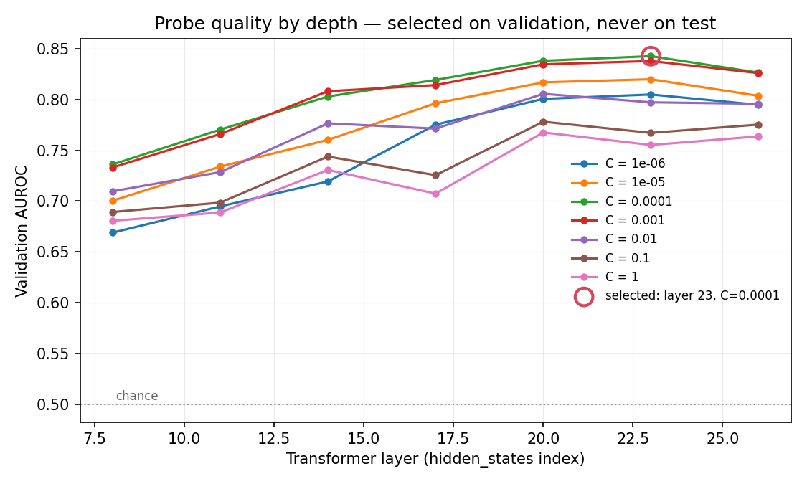
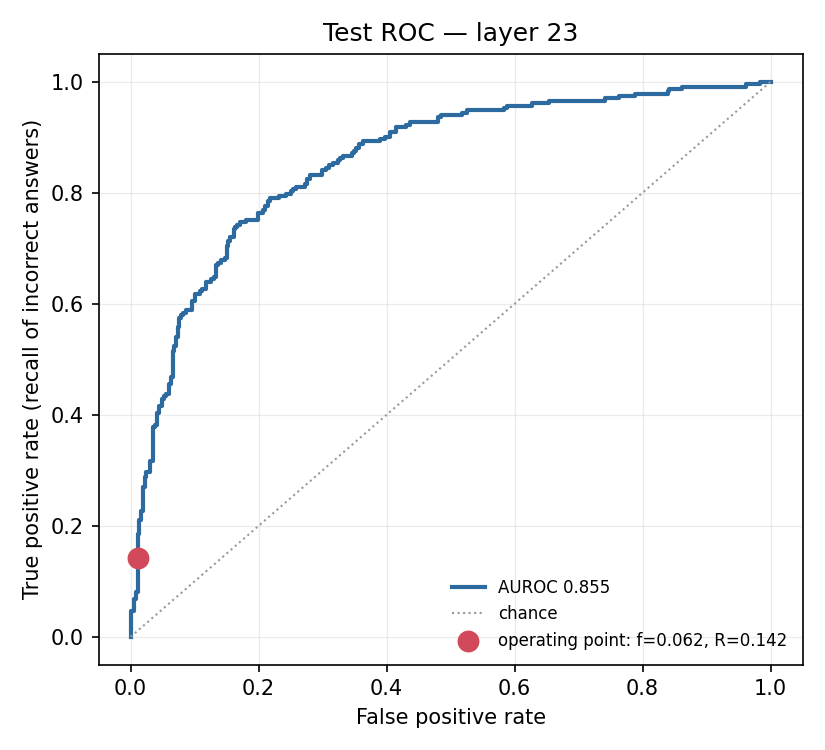

# RESULTS

Generated by `scripts/05_report.py`. Every number below is read from a JSON artifact in this directory; none is hand-entered.

## 1. Run metadata

| Field | Value |
|---|---|
| Model | `Qwen/Qwen2.5-7B-Instruct` |
| Quantisation | nf4 (bfloat16 compute) |
| Device | Tesla T4 |
| Seed | 1729 |
| Config hash | `c429ce5e92da9a22` |
| Git commit | `6a77b3e4aa5c5abd2b84a07dad777814ae65a39b` |
| Working tree dirty at run time | True |
| Timestamp (UTC) | 2026-08-22T02:13:15+00:00 |
| torch / transformers | 2.10.0+cu128 / 5.0.0 |

Left-padding equivalence check: relative L2 error **1.556e-02** (limit 1e-01), cosine similarity **0.999880** (limit 0.9990), across 4 prompts spanning the length distribution. Batched and unbatched last-token activations agree, so position -1 is the true final prompt token and not a pad token (CLAUDE.md invariant 4).

Positive control: repeating the same comparison with the tokenizer deliberately **right**-padded gives relative L2 1.278e+00 and cosine 0.1414 — rejected, as it must be. The check is therefore demonstrated to discriminate a real padding fault on this model and this hardware, not merely to have passed.

## 2. Dataset

| Field | Value |
|---|---|
| Source | `mandarjoshi/trivia_qa`, config `rc.nocontext`, split `validation` |
| Rows loaded | 17,944 |
| Dropped as duplicate questions | 7,983 |
| Dropped as empty or aliasless | 0 |
| Sampled | 3,000 |
| Split sizes | train 1,800 / val 600 / test 600 |
| Accuracy (lenient alias match) | 0.594 |
| Accuracy (strict exact match) | 0.106 |
| **Base error rate (positive class)** | **0.406** |

Splits are by `question_id` after deduplicating normalised question strings, and are asserted pairwise disjoint on both keys (CLAUDE.md invariant 3).

**Labelling note.** Lenient and strict matching disagree by 0.488 in accuracy, more than the ~10 point threshold SPEC.md §2 asks to be called out. The lenient rule is primary (DECISIONS.md 007); the gap is the amount of correctness attributable to a gold alias appearing inside a longer sentence.

## 3. Layer sweep — validation AUROC

| Layer | C=1e-06 | C=1e-05 | C=0.0001 | C=0.001 | C=0.01 | C=0.1 | C=1 |
|---|---|---|---|---|---|---|---|
| 8 | 0.6690 | 0.7004 | 0.7360 | 0.7330 | 0.7096 | 0.6893 | 0.6806 |
| 11 | 0.6948 | 0.7339 | 0.7703 | 0.7659 | 0.7285 | 0.6985 | 0.6888 |
| 14 | 0.7193 | 0.7602 | 0.8028 | 0.8080 | 0.7764 | 0.7438 | 0.7306 |
| 17 | 0.7751 | 0.7962 | 0.8191 | 0.8140 | 0.7712 | 0.7255 | 0.7073 |
| 20 | 0.8005 | 0.8167 | 0.8380 | 0.8344 | 0.8054 | 0.7781 | 0.7675 |
| 23 | 0.8048 | 0.8198 | **0.8425** | 0.8377 | 0.7971 | 0.7671 | 0.7552 |
| 26 | 0.7946 | 0.8034 | 0.8263 | 0.8258 | 0.7956 | 0.7752 | 0.7636 |

**Selected: layer 23 of 28, C = 0.0001**, on validation AUROC 0.8425. The layer, the regularisation strength and the threshold were all chosen here. The test set was opened afterwards, once (CLAUDE.md invariant 2, DECISIONS.md 006).

## 4. Test results

**The test set has been scored 2 times**, at n = 600. Disclosed rather than claimed: every scoring is appended to `results/test_scoring_log.json` and reproduced below. Each selection that produced one was made on validation alone (DECISIONS.md 016).

| # | Layer | C | AUROC | `f` | `R` | Lift | Config hash |
|---|---|---|---|---|---|---|---|
| 1 | 23 | 0.0001 | 0.8551 | 0.0617 | 0.1416 | 2.30x | `c429ce5e92da9a22` |
| 2 | 23 | 0.0001 | 0.8551 | 0.0617 | 0.1416 | 2.30x | `c429ce5e92da9a22` |

| Metric | Value | 95% CI |
|---|---|---|
| AUROC | 0.8551 | [0.8217, 0.8878] |
| Measured flag rate `f` | 0.0617 | [0.0433, 0.0817] |
| Recall `R` | 0.1416 | [0.1004, 0.1865] |
| Precision | 0.8919 | [0.7838, 0.9756] |
| Base error rate | 0.3883 | — |

Confusion at the frozen threshold (1.5881): TP 33, FP 4, FN 200, TN 363. 37 of 600 responses flagged; 233 were incorrect.

Precision and recall are reported separately and never blended (CLAUDE.md invariant 5). Low precision is by design: a false positive costs one wasted judge call, a false negative costs a user acting on a wrong answer (DECISIONS.md 005).

The threshold was chosen on validation to hit a flag rate of 0.050 and achieved 0.050 there. On test the measured rate is 0.0617, and **that measured value is what every calculation below uses** (CLAUDE.md invariant 6).

## 5. Three policies at N = 1,000,000

Assumed base error rate 0.030 (illustrative), judge accuracy 1.00.

| Policy | Judge calls | Responses seen by any check | Errors caught | Relative cost |
|---|---|---|---|---|
| Judge everything | 1,000,000 | 100% | 30,000 | 16x |
| Random 6.2% sample | 61,667 | 6.16667% | 1,850 | 1x |
| **Probe-triggered** | **61,667** | **100%** | **4,249** | **1x** |

Coverage and verdict are different things. Every response passes the cheap probe; only the expensive verdict is rationed. Random sampling has 6.2% coverage *and* 6.2% verdict. That gap is the result.

> **The 'errors caught' column mixes two regimes.** It applies the recall measured at a base error rate of 0.3883 to an assumed production rate of 0.030. The **ratio** between the rows is unaffected — that is the point of `lift`, and both the assumed rate and judge accuracy cancel from it. The **absolute counts** are conservative: at the lower assumed rate the same probe would reach a higher recall (see the projection below), so the probe-triggered row understates rather than overstates.

## 6. Headline — lift

### lift = R / f = 2.30x [2.02, 2.63]

At the same judge budget as random sampling, the probe surfaces **2.30x** as many wrong answers.

**The base error rate assumed in the policy table, and the judge's accuracy, both cancel from the ratio.** They appear in every policy's errors-caught figure, so the multiplier does not rest on an assumption about how often the model is wrong in production or about how good the judge is.

**But the measured lift is bounded by the base rate of the set it was measured on**, and that is a different statement. Algebraically `lift = R/f = precision / base_rate`, so precision <= 1 caps lift at `1 / base_rate` = **2.58x** on this test set, whose base error rate is 0.3883. The measured 2.30x is **89.2% of everything that was attainable here.** No probe, however well it ranks, could have scored much higher on this dataset (DECISIONS.md 015).

Checked both ways: `R/f` = 2.2967 and `precision/base_rate` = 2.2967.

The ceiling is itself an estimate: [2.35, 2.86] over the same bootstrap resamples. A resample drawing fewer incorrect answers has a higher ceiling, which is why the interval on lift ([2.02, 2.63]) can reach above the 2.58x computed from the point base rate. Within any single resample the two cannot cross: `lift / ceiling` is precision, which is at most 1.

#### Headroom at lower base error rates — a projection, not a result

A ROC curve is base-rate independent: it describes how well the probe *ranks*, which is a property of the probe rather than of how often the model is wrong. So the measured curve can be re-read at other base error rates, holding the budget at the measured `f` = 0.0617.

| Base error rate | Budget `f` | Recall `R` | Lift | Ceiling (1/base rate) |
|---|---|---|---|---|
| 0.100 | 0.0587 | 0.3176 | 5.41x | 10.0x |
| 0.050 | 0.0616 | 0.4034 | 6.55x | 20.0x |
| 0.030 | 0.0605 | 0.4292 | 7.10x | 33.3x |
| 0.010 | 0.0583 | 0.4378 | 7.51x | 100.0x |

> **PROJECTION, NOT MEASUREMENT. A ROC is base-rate independent, so the measured curve can be read at another base error rate. This assumes the probe ranks equally well on that workload -- the cross-domain generalisation this repo has NOT tested. Treat as an illustration of headroom, never as a result.**

Demonstrated, not asserted: recomputing the table across error rates [0.01, 0.03, 0.1, 0.5] and judge accuracies [0.5, 0.8, 1.0] gives 12 lifts with a spread of 8.9e-16 (all equal: True).

The interval is a 95% percentile bootstrap over 1,000 resamples of the 600 test examples, resampling recall and flag rate jointly because lift is their ratio.

## 7. Latency

| Measurement | Value |
|---|---|
| Probe score, median (full scikit-learn call) | 228.7 µs |
| Probe score, p95 | 315.1 µs |
| — of which arithmetic (standardise + dot + bias) | 7.7 µs |
| Generation, median per response | 2557.3 ms |
| Prefill, median per response | 351.4 ms |
| Probe / generation | 8.94e-05 |
| Probe / prefill | 6.51e-04 |
| Device | Tesla T4 |
| torch | 2.10.0+cu128 |
| Quantisation | nf4 |

**The probe adds no additional forward pass.** The activation is a by-product of the prefill that generation already performs, so its marginal cost is the scale-and-dot-product timed above and nothing else.

The headline figure is the whole scikit-learn call. Most of it is input validation and array copying, not arithmetic: the dot product itself is 29.8x faster. The slower, deployable number is quoted as the headline on purpose.

Extraction throughput for reference: 3,000 examples in 2h 19m (0.36 examples/s) at batch size 8.

## 8. Secondary validation — abstention correlation

Abstention rate on test is 0.0000 (0 of 600), below the 0.02 floor. **The comparison is underpowered and is not reported as a result** (SPEC.md §9).

## 9. Negative control — reproducing a documented limitation

Not run — **and not implemented in this build**. The published result reports that probe generalisation falters on mathematical reasoning (DECISIONS.md 008), and reproducing that on GSM8K is Stage 6 of `TASKS.md`: an optional stage that requires a completed main run first. The `negative_control` block in `config.yaml` reserves the settings for it, but no code reads them yet, so setting `enabled: true` does nothing today. Until Stage 6 is built and run, cross-domain generalisation is untested here and is listed as a limitation below.

## 10. Limitations

- **The headline lift is bounded by this benchmark, not by the probe.** `lift = precision / base_rate`, so a base error rate of 0.3883 caps it at 2.58x however well the probe ranks. The measured value reaches 89.2% of that. The transferable quantity is the AUROC; the lift is specific to a workload where the model is wrong this often (DECISIONS.md 015).
- **One model, one dataset.** `Qwen/Qwen2.5-7B-Instruct` on mandarjoshi/trivia_qa (rc.nocontext). Cross-model and cross-dataset generalisation is untested here.
- **Knowledge questions only.** The published result reports that generalisation falters on mathematical reasoning; the GSM8K control was not run, so that boundary is cited here rather than measured.
- **This measures the probe, not a system.** There is no gateway, no serving path, and no end-to-end latency under load. The latency figures are component measurements taken in isolation.
- **`f` depends on workload.** The flag rate of 0.0617 is for this dataset at this threshold. Real traffic has a different difficulty distribution and would produce a different rate at the same threshold.
- **Judge accuracy is assumed to cancel.** It does cancel from the ratio, but a real judge misses errors the probe correctly flagged, so the absolute errors-caught counts in the three-policy table are upper bounds.
- **Single seed.** Everything reported is at seed 1729. No seed sweep was run, so the intervals reflect test-set sampling only, not variation in the split or in probe fitting.
- **Labelling is automatic.** Normalised alias matching is a proxy for correctness, not human judgment. Lenient and strict matching differ by 0.488 in accuracy here.
- **Test set is small.** 600 examples, which is why every headline number carries a bootstrap interval rather than a point estimate alone.

